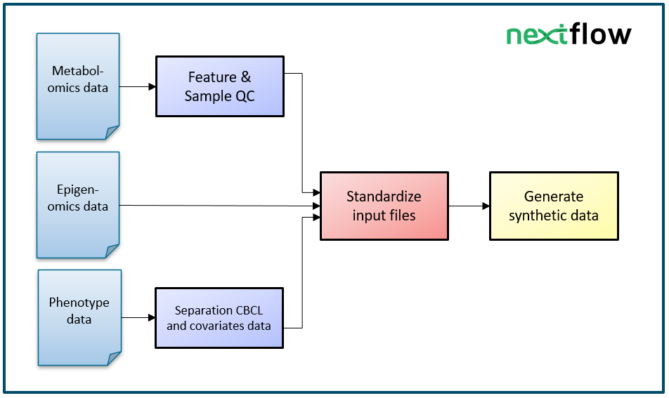

# Data preparation workflow

This workflow converts the original data of ACTION-NTR and CURIUM that was uploaded to the Digital Research Environment (DRE) into standardized formats, through which they can be used as input for the [main workflow](https://github.com/Xomics/ACTIONdemonstrator_workflow). 

# Pipeline summary

The NTR-ACTION data preparation workflow consists of a set of different steps:



# Documentation
[More complete documentation on the workflow can be found here](Documentation.md)

# Usage

## Run main workflow:

For detailed instructions on how to run the workflow:
```
nextflow run action_file_preparation.nf  --help
```

To run the workflow with the NTR-ACTION cohort: 

```
nextflow run action_file_preparation.nf 
	--output  /dir/of/choice
	--container_dir /mnt/workspace/Singularity/ 
	--mtblmcs_values /mnt/workspace/Data/metabolomics_and_biomarkers/upload/XOmics_NTR_ACTION_MtblmcsValues.tsv 
	--mtblmcs_variables /mnt/workspace/Data/metabolomics_and_biomarkers/upload/XOmics_NTR_ACTION_MtblmcsVariables.tsv 
	--mtblmcs_dictionary /mnt/workspace/Data/metabolomics_and_biomarkers/upload/ACTION_dictionary.xlsx 
	--phenotypes_set2 /mnt/workspace/Data/phenotypes/upload/NTR_2056_Jenny_van_Dongen_ActionDemonstrator_set2_20210202.sav 
	--phenotypes_set3 /mnt/workspace/Data/phenotypes/upload/NTR_2056_Jenny_van_Dongen_ActionDemonstrator_set3_20210202.sav 
	--epigenomics_values /mnt/workspace/Data/epigenetics/Drake_input_files/ACTION.EPIC.betas_NTR.csv
	--epigenomics_meta /mnt/workspace/Data/epigenetics/upload/ACTION.metadata_NTR_22092020.RData 
	--ids /mnt/workspace/Data/IDs/ACTIONdemonstrator_XOmics_IDs_09022021.csv 
	--T_scores /mnt/workspace/Data/phenotypes/upload/TR_2714_Action_Tscores_ASEBA_20210628.sav
```


To run the workflow with the CURIUM cohort: 
```
nextflow run action_file_preparation.nf 
	--output  /dir/of/choice
	--container_dir /mnt/workspace/Singularity/ 
	--mtblmcs_values /mnt/workspace/Data/CURIUM/20220429_PreQC_ValuesDF_CuriumXomics.csv 
	--mtblmcs_variables  /mnt/workspace/Data/CURIUM/20220429_PreQC_VariableDF.csv--mtblmcs_variables
	--mtblmcs_sample_meta /mnt/workspace/Data/CURIUM/20220429_CuriumVariablesForMtblmcsQC_CuriumXomics.csv
	--mtblmcs_dictionary /mnt/workspace/Data/metabolomics_and_biomarkers/upload/ACTION_dictionary.xlsx #Same as for ACTION-NTR
	--phenotypes_set2 /mnt/workspace/Data/CURIUM/ACTION_clinical_CuriumXomics.csv
	--epigenomics_values /mnt/workspace/Data/CURIUM/ACTION.EPIC.betas_curium.csv
	--epigenomics_meta /mnt/workspace/Data/CURIUM/ACTION.metadata_Curium_23082022.Rdata
	--ids /mnt/workspace/Data/CURIUM/ACTIONdemonstrator_Curium_XOmics_IDs_09062022.csv 
	--curium
```


# Using containers

### Create Docker image, convert to Singularity

Define a Dockerfile (example: *Container_files\r-base-phenotypes\Dockerfile*), build Docker image, push to registry, save to archive, and convert to Singularity image.

Build docker image on a local machine and push to the registry:
```{bash}
docker login registry.cmbi.umcn.nl
docker build -t registry.cmbi.umcn.nl/x-omics-action-dataset/action_nextflow/r-base-phenotypes:$VERSION .
docker push registry.cmbi.umcn.nl/x-omics-action-dataset/action_nextflow/r-base-phenotypes:$VERSION
```

Run in the Digital Research Environment:
```{bash}
docker pull registry.cmbi.umcn.nl/x-omics-action-dataset/action_nextflow/r-base-phenotypes:$VERSION
docker images # to get IMAGE_ID
docker save $IMAGE_ID -o r-base-phenotypes.tar
sudo singularity build r-base-phenotypes.sif docker-archive://r-base-phenotypes.tar
```
